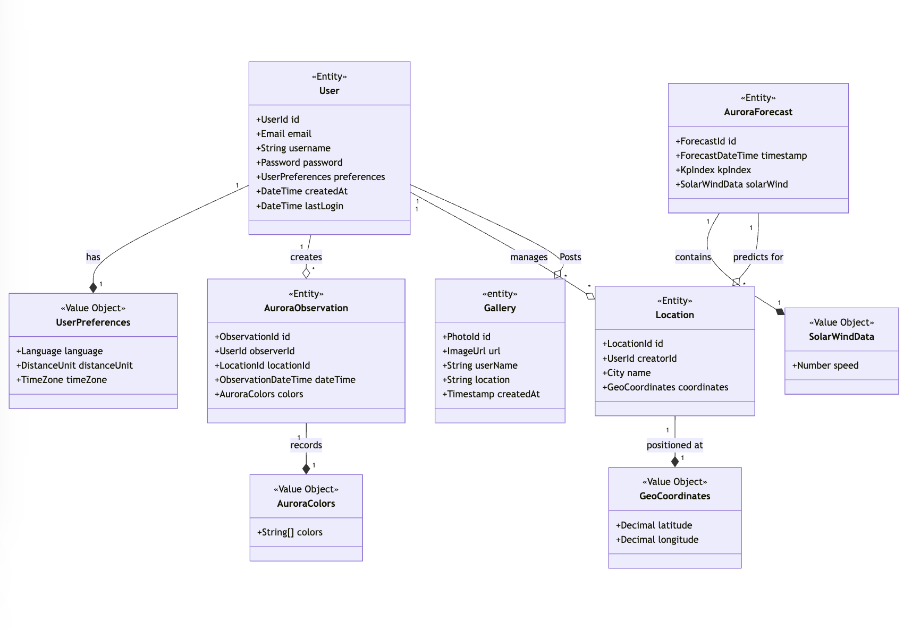

Welcome to the LightsTrail website repository.

### Project Title: LightsTrail

#### Project Description: 

LightsTrail is a web-based application designed to provide real-time aurora predictions and forecasts, enabling users to experience and track the Northern Lights at any location. Tailored for aurora enthusiasts, travelers, and photographers, the app delivers accurate aurora forecasts based on the user’s location. Users can subscribe to alerts for receiving notifications when auroras are predicted in their area, either in real-time or triggered by specific Index thresholds. Additionally, LightsTrail fosters a community-driven platform where users can share photos, experiences, and sightings and gain insights into the best viewing spots through location-tagged posts. With a blend of observation technology and social engagement, the app offers a dynamic and engaging platform for aurora enthusiasts worldwide.

### Key Features:

1. Login: Fields: Username and Password are two fields used for authenticating the user. The username can be email id.Password must be at least 8 characters long and have special characters. The username and password key-value will be verified immediately when the user clicks on login button.

2. Signup / Register: Fields: Username, Password, Confirm Password. The Username can be email id. Password and Confirm Password must be at least 8 characters long and must have special characters. Both Password and Confirm Password should be exactly matching. 

3. Aurora Predictions and observations: Provides immediate aurora predictions based on the user’s input location.

4. Location-Based Alerts: Users can subscribe to alerts for aurora events, including real-time notifications or alerts triggered by certain  thresholds.

5. Community Post Interaction: Share photos, location, experiences, and advice on aurora sightings.

### Domain Model

    classDiagram
        class User {
            <<Entity>>
            +UserId id
            +Email email
            +String username
            +Password password
            +UserPreferences preferences
            +DateTime createdAt
            +DateTime lastLogin
        }
 
    class AuroraObservation {
        <<Entity>>
        +ObservationId id
        +UserId observerId
        +LocationId locationId
        +ObservationDateTime dateTime
       
        +AuroraColors colors
 
    }
 
    class Location {
        <<Entity>>
        +LocationId id
        +UserId creatorId
        +City name
        +GeoCoordinates coordinates
       
    }
 
    class AuroraForecast {
        <<Entity>>
        +ForecastId id
        +ForecastDateTime timestamp
        +KpIndex kpIndex
        +SolarWindData solarWind
    }
 
    %% Value Objects
    class UserPreferences {
        <<Value Object>>
         +Language language
        +DistanceUnit distanceUnit
        +TimeZone timeZone
    }
 
    class GeoCoordinates {
        <<Value Object>>
        +Decimal latitude
        +Decimal longitude
     }
 
   
 
    class AuroraColors {
        <<Value Object>>
        +String[] colors
       
    }
 
   
    class SolarWindData {
        <<Value Object>>
        +Number speed
   
    }
 
     class Gallery {
        <<entity>>
        +PhotoId id
        +ImageUrl url  
        +String userName
        +String location
        +Timestamp createdAt
    }
 
 
    %% Relationships with Cardinality
    User "1" --* "1" UserPreferences : has
    User "1" --o "*" AuroraObservation : creates
    User "1" --o "*" Location : manages
    User "1" --o "*" Gallery : Posts
   
     AuroraObservation "1" --* "1" AuroraColors : records
     
    Location "1" --* "1" GeoCoordinates : positioned at
   
    AuroraForecast "1" --* "1" SolarWindData : contains
    AuroraForecast "1" --o "*" Location : predicts for

### Team Memebers:
1. Pooja Doddannavar: doddannavar.p@northeastern.edu

2. Aryaa Hanamar: hanamar.a@northeastern.edu

3. Samarth Rayar: rayar.s@northeastern.edu

4. Siddharth Nashikkar: nashikkar.s@northeastern.edu

